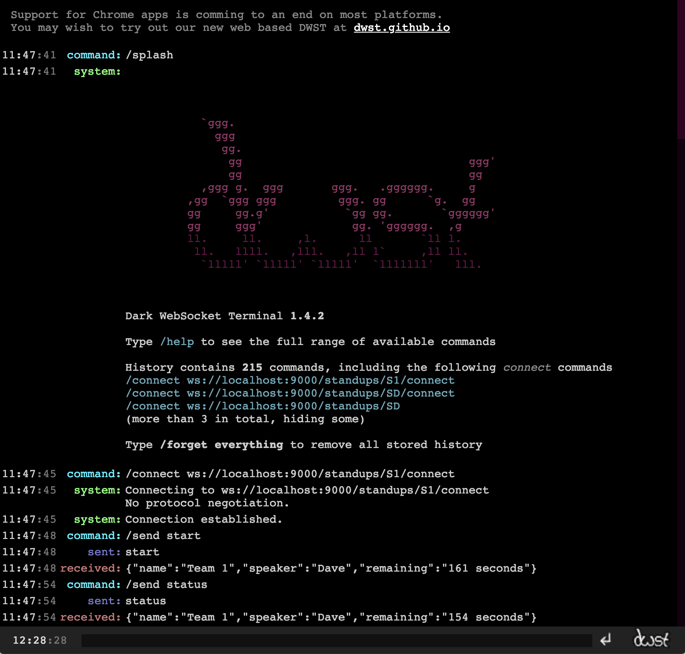

# Countdown

## Domain
  - Standup - Stream of work running the standup
  - Team - Team providing update in standup
  - Speaker - Team member speaking in standup
## Endpoints
  #### Standups: ``` GET /standups```
  ##### Code : 200 OK
  ###### Example ```/standups```
```json
[
    "S1",
    "S2"
]
```

  #### A Standup details: ```GET /standups/[stream name]```
  ##### Code : 200 OK
 ###### Example ```/standups/S1```
```json
{
    id: 1,
    name: "S1",
    teams: [
        {
        id: 1,
        name: "Team 1",
        speaker: "Dave",
        allocation: "180 seconds"
        },
        {
        id: 2,
        name: "Team 2",
        speaker: "Tom",
        allocation: "120 seconds"
        }
    ]
}
```
  #### Running a Standup
    
    We have admin and client connection. Admin connection is used to manage the standup while client connection is used to
    enquire standup status.  
    
  ##### Admin
  An admin can 
  * start : Start the standup
  * stop: Stop the standup
  * pause: Pause an update
  * next: Skip the update  
  
  ###### To start: ```GET    /admin/standups/:name/connect```
  ####### Sample response
  ```
  {"message":"Standup S1 started"}
  ```  
  ###### To pause: ```pause```
  ####### Sample response
  ```json
  {"name":"Team 1","speaker":"Dave","remaining":"161 seconds"}
  ```
  
  ###### To skip to next: ```next```
  ####### Sample response
  ```json
  {"name":"Team 2","speaker":"Tom","remaining":"161 seconds"}
  ```

  ###### To stop the standup : ```stop```
  ####### Sample response
  ```json
  	{"message":"Standup S1 finished"}
  ```

  ##### Client
  An client can 
  * connect : Connect to the standup in progress to get status update
  * disconnect: Disconnect from the standup in progress

  ##### To connect: ```GET    /client/standups/:name/connect```
    
  ###### Sample response
  ```json
  {"name":"Team 1","speaker":"Dave","remaining":"161 seconds"}
  ```
  
  ##### To disconnect: ```disconnect```
  ###### Sample response
  ```json
  {"message":"Disconnecting from S1."}
  ```    

## Runnning the application

### Prerequisite
* Java 8
* Sbt 1.x

    This is a typical play application which ca either be run from ide in development or using ```sbt run```. 
This application will start on port 9000 and will be accessible through the end points listed above.
    This application is operated using web-sockets command. To test or develop the application, a chrome
plugin ```Dark WebSocket Terminal``` can be used. 

